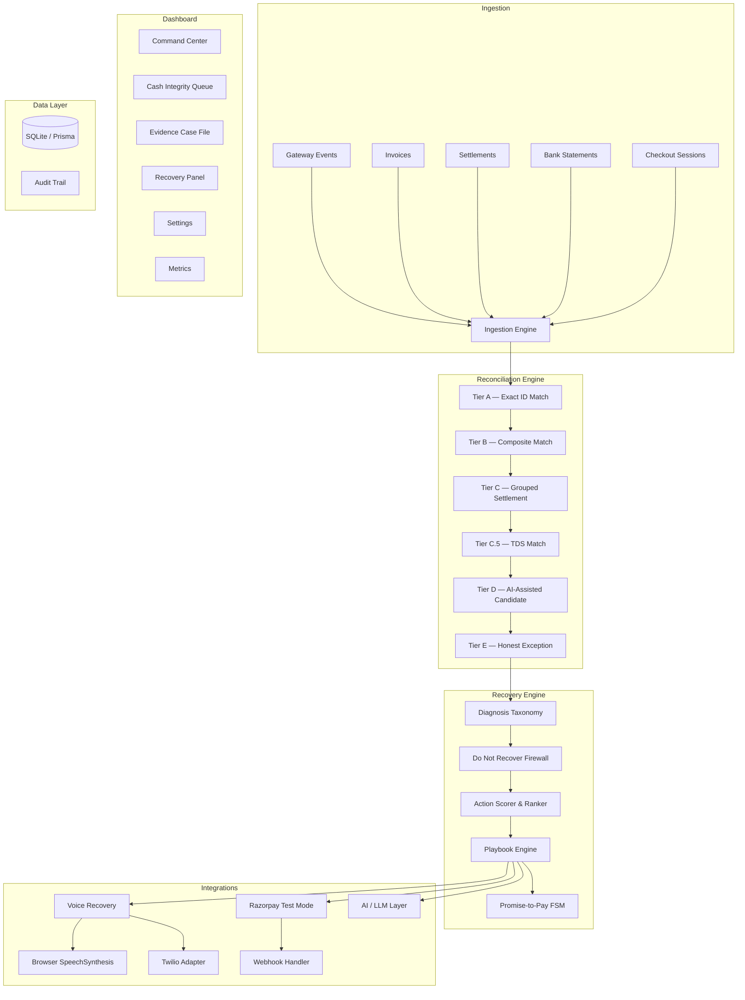

# Cash Integrity Controller (CIC)

> **An explainable, policy-bound AI finance-operations agent for Razorpay merchants.**

CIC reconciles what a merchant expected to receive with what actually reached the bank, identifies cases that are genuinely recoverable, executes only the least intrusive policy-approved action, and proves the result with a complete audit trail.

**Razorpay Buildathon** — Combines Track 3 (AI Revenue Recovery) and Track 4 (AI Finance Controller) into one closed loop.

> ⚠️ **Disclosure**: This prototype uses synthetic data, test-only payments, and simulated communications. No real customer data or live payment processing. Not a claim of production compliance — described as policy-bound, consent-aware, and built for review.

---

## Architecture



---

## Key Differentiators

1. **Evidence Graph** — One graph across checkout, payment attempt, invoice, settlement, and bank credit
2. **Deterministic Reconciliation** — Tiered matching before AI reasoning. All money in integer paise (minor units), never floats
3. **Do Not Recover Firewall** — Stops customer contact when the issue is settlement lag, refund, dispute, duplicate, risk hold, or accounting ambiguity
4. **Policy Compiler** — Bounds retries, contact frequency, channel, consent, PTP, risk holds, and human approval
5. **Measured Recovery** — Recovery attribution tracked with baseline/holdout, not assumed causation
6. **Settlement Q&A** — Ask questions about any settlement and get grounded answers with calculation chips

---

## Local Setup

### Prerequisites
- Node.js ≥ 18
- npm

### Installation

```bash
# Clone the repository
git clone <repo-url>
cd cic

# Install dependencies
npm install

# Set up the database
npx prisma db push

# Seed with 120-record synthetic batch
npm run db:seed

# Start development server
npm run dev
```

Open [http://localhost:3000](http://localhost:3000).

### Environment Variables

Copy `.env.example` to `.env`:

```bash
cp .env.example .env
```

| Variable | Required | Default | Description |
|----------|----------|---------|-------------|
| `DATABASE_URL` | ✅ | `file:./dev.db` | SQLite database path |
| `RAZORPAY_KEY_ID` | ❌ | — | Razorpay Test Mode key (must start with `rzp_test_`) |
| `RAZORPAY_KEY_SECRET` | ❌ | — | Razorpay Test Mode secret (server-only, never in browser) |
| `RAZORPAY_WEBHOOK_SECRET` | ❌ | — | Webhook signature verification secret |
| `ENABLE_RAZORPAY_TEST_MODE` | ❌ | `false` | Set to `true` to enable real Payment Links |
| `APP_BASE_URL` | ✅ | `http://localhost:3000` | Base URL for webhooks and callbacks |
| `OPENAI_API_KEY` | ❌ | — | Enables LLM-powered Settlement Q&A (deterministic fallback always works) |
| `ENABLE_OUTBOUND_CALLS` | ❌ | `false` | Set to `true` to enable Twilio voice calls |
| `VOICE_TEST_TO_NUMBER` | ❌ | — | Developer-owned number for test calls only |
| `TWILIO_ACCOUNT_SID` | ❌ | — | Twilio account identifier |
| `TWILIO_AUTH_TOKEN` | ❌ | — | Twilio auth token (server-only) |
| `TWILIO_FROM_NUMBER` | ❌ | — | Twilio phone number for outbound calls |
| `NODE_ENV` | ❌ | `development` | Environment mode |

### NPM Scripts

```bash
npm run dev        # Start dev server
npm run build      # Production build
npm run db:seed    # Seed database with synthetic data
npm run db:reset   # Reset and reseed database
npm run db:push    # Push schema changes
npm run db:studio  # Open Prisma Studio
npm run test       # Run all tests
```

---

## Demo Mode Walkthrough

**Everything works without any API keys.** The default experience is a complete local demo.

### 6-Minute Demo Flow

1. **Load & Process** — Open the Command Center (`/`). Click "▶ Run Engine" to process the 120-record seeded batch.

2. **Cash Bridge & Forecast** — View the cash bridge waterfall showing Expected → Captured → Settled → Exceptions → Recovery. Drill into the 7/14/30-day Forward Cash Forecaster to see PTP-weighted and recovery-weighted projections.

3. **Exact Match Proof** — Open the Queue (`/queue`), find a matched case, open its Case File. View the matching math, evidence chain, and calculation breakdown. Use the Settlement Q&A to ask: "Why did settlement set_883 differ by ₹340?"

4. **TDS & Exception** — Find a `matched_with_tds` case — verify TDS evidence and rule application. Then open a finance_review case (₹50,000 short settlement) — verify CIC abstains and blocks customer recovery.

5. **Recovery** — Open a recoverable failed payment or high-intent checkout case. See why Payment Link is allowed while alternatives are blocked by the firewall.

6. **Payment Link** — Click "Execute" on the allowed Payment Link action. If Razorpay Test Mode is configured, a real Test Mode link is created. Otherwise, a labeled `SIMULATED` receipt appears.

7. **Re-reconcile** — After recovery action, the cash bridge and forecast update automatically.

8. **Promise-to-Pay** — Open the Recovery Panel for a PTP case. Capture a Friday promise. Verify normal dunning pauses. Simulate payment or breach.

9. **Firewall Proof** — Open a risk_hold/opt-out/hard_decline case. Show the Do Not Recover firewall blocking all actions with specific gate reasons.

10. **Metrics** — View precision, coverage, honesty rate, recovery amount, blocked actions, and traceability on the Metrics screen.

---

## Razorpay Test Mode Setup

### Getting Test Keys

1. Sign in to [Razorpay Dashboard](https://dashboard.razorpay.com)
2. Switch to **Test Mode** (toggle in top bar)
3. Go to **Settings → API Keys** → Generate Test Keys
4. Copy `rzp_test_xxx` (Key ID) and the secret

### Configuration

```env
RAZORPAY_KEY_ID=rzp_test_YOUR_KEY_ID
RAZORPAY_KEY_SECRET=YOUR_KEY_SECRET
RAZORPAY_WEBHOOK_SECRET=YOUR_WEBHOOK_SECRET
ENABLE_RAZORPAY_TEST_MODE=true
APP_BASE_URL=https://your-public-test-host.example
```

### Webhook Setup

1. In Razorpay Dashboard → **Webhooks** → Add New
2. Set URL: `https://your-public-host/api/webhook/razorpay`
3. Select events: `payment_link.paid`, `payment.captured`
4. Copy the webhook secret to `RAZORPAY_WEBHOOK_SECRET`

> **Important**: Webhooks require a publicly reachable endpoint. Use [ngrok](https://ngrok.com) or a similar tunnel for local development: `ngrok http 3000`

### Webhook Handling

- **HMAC SHA-256 Verification**: Every webhook is verified against `X-Razorpay-Signature` using the raw request body
- **Deduplication**: `x-razorpay-event-id` is stored in audit events to prevent double processing
- **Idempotent Processing**: Events are processed idempotently — replaying a webhook has no side effects
- **Out-of-Order Tolerance**: Payment state only advances forward, never regresses

### Limitations

- Test Mode uses dummy transactions — no real money is involved
- Standard Payment Links only (UPI Payment Links are NOT supported in Test Mode per [Razorpay docs](https://razorpay.com/docs/api/payments/payment-links/))
- 30 Payment Link limit per Test Mode business
- Keep Test and Live webhook URLs separate

---

## Voice Recovery

### Browser Demo (Always Available)

The browser voice adapter uses the Web Speech Synthesis API to play an approved Hinglish script. No external services needed.

1. Open any recoverable case → Recovery Panel
2. Click "📞 Start Voice Call"
3. The Hinglish script plays through your browser speakers
4. Use the response selector to simulate: Pay Now, Promise Friday, Need Help, Opt Out, No Answer
5. Each response creates real audit events and state transitions

### Approved Hinglish Script

> "Namaste, main [Merchant] ki payment assistance team se bol raha hoon. Aapke [Reference] ke liye ₹[Amount] ka payment abhi pending dikh raha hai. Hum kabhi OTP, UPI PIN, card number ya bank details nahi maangenge. Payment link ke liye 1, Friday tak promise ke liye 2, support ke liye 3, opt-out ke liye 9."

An English fallback is also available.

### Twilio Test Call (Optional)

For real outbound calls to a developer-owned test number:

```env
ENABLE_OUTBOUND_CALLS=true
VOICE_TEST_TO_NUMBER=+91XXXXXXXXXX  # Your own verified number
TWILIO_ACCOUNT_SID=ACxxxxxxxx
TWILIO_AUTH_TOKEN=xxxxxxxx
TWILIO_FROM_NUMBER=+1XXXXXXXXXX
```

**Safety Guards**:
- Calls only to `VOICE_TEST_TO_NUMBER` (developer-owned)
- `ENABLE_OUTBOUND_CALLS` must be explicitly `true`
- Voice only for `recoverable` cases with voice consent, no opt-out, no risk hold, no active PTP, no contact cap breach
- Never asks for card number, OTP, UPI PIN, bank password, or any credentials
- Payment is handled only through secure Payment Links, never over voice

### DTMF Options (Twilio)
| Key | Action |
|-----|--------|
| 1 | Send secure payment link |
| 2 | Record PTP date |
| 3 | Request human support |
| 9 | Opt out of future calls |

---

## Settlement Q&A

The Settlement Q&A inspector is available on every Evidence Case File. Ask questions like:
- "Why did settlement set_883 differ by ₹340?"
- "Is set_001 reconciled?"
- "What are the deductions on this settlement?"

### How It Works
1. Resolves the settlement ID from your question
2. Retrieves the deterministic breakdown (gross, fees, tax, adjustments, net, bank credit)
3. Returns a structured answer with calculation chips, evidence refs, and confidence

### With vs Without LLM
| Feature | Without `OPENAI_API_KEY` | With `OPENAI_API_KEY` |
|---------|--------------------------|----------------------|
| Answer accuracy | ✅ Identical (deterministic) | ✅ Identical (verified) |
| Monetary values | From engine only | From engine only (LLM cannot alter) |
| Language | Template-based | Natural language |
| Response | Instant | ~1-2 seconds |

The LLM is only allowed to rephrase — all monetary values come from the deterministic engine. If the LLM returns different numbers, the system falls back to the template answer.

---

## Testing

```bash
# Run Phase 3 tests (engine, firewall, scorer, diagnosis)
npx tsx src/lib/engine/__tests__/phase3.test.ts

# Run Phase 5 tests (integrations, safety, voice, Q&A)
npx tsx src/lib/engine/__tests__/phase5.test.ts
```

### What's Tested

| Category | Tests |
|----------|-------|
| Integer Arithmetic | All money uses integer paise, no floats |
| Webhook HMAC | SHA-256 verification rejects bad signatures |
| Test Mode Gating | Adapter never called without `ENABLE_RAZORPAY_TEST_MODE=true` |
| Key Validation | Rejects live keys (`rzp_live_`), only accepts `rzp_test_` |
| Voice Gating | No outbound calls without `ENABLE_OUTBOUND_CALLS=true` + number |
| Browser Voice | Always succeeds without external dependencies |
| Twilio Fallback | Fails gracefully without credentials |
| PTP Extraction | Parses "Friday", "kal", "Monday", "next week" from Hinglish |
| Script Rendering | All template variables replaced, no `{{}}` artifacts |
| Settlement Q&A | Deterministic answers, correct residual calculation |
| Firewall Blocks | Hard decline, refund, opt-out, PTP, pending settlement, risk hold, dispute, finance review |
| Message Drafting | Safe templates for SMS, email, WhatsApp |

---

## Tech Stack

- **Framework**: Next.js 16 (App Router) + TypeScript
- **Database**: SQLite with Prisma ORM
- **Validation**: Zod schemas for all API boundaries
- **Styling**: Custom CSS design system (Inter + JetBrains Mono)
- **Payments**: Razorpay Test Mode (optional)
- **Voice**: Browser SpeechSynthesis + Twilio (optional)
- **AI**: OpenAI structured output with deterministic fallback (optional)

---

## API Routes

| Method | Route | Description |
|--------|-------|-------------|
| POST | `/api/reconcile` | Run reconciliation engine |
| POST | `/api/ingest` | Ingest raw records |
| GET | `/api/dashboard` | Dashboard summary data |
| GET | `/api/cases` | List recovery cases |
| GET/PATCH | `/api/cases/[id]` | Case detail + human review |
| GET/POST | `/api/actions` | Score and execute recovery actions |
| GET/POST | `/api/playbook` | Preview and run playbook steps |
| GET/PUT/POST | `/api/policy` | Policy CRUD |
| POST | `/api/ptp` | Promise-to-Pay operations |
| GET | `/api/forecast` | Forward cash projections |
| GET | `/api/metrics` | Evaluation metrics |
| GET | `/api/audit` | Audit event log |
| POST | `/api/voice` | Start/respond voice calls |
| POST | `/api/settlement-qa` | Settlement Q&A inspector |
| POST | `/api/webhook/razorpay` | Razorpay webhook ingestion |
| POST | `/api/webhook/twilio` | Twilio TwiML callback |
| POST | `/api/reset` | Reset and reseed database |

---

## Official References

- [Razorpay Quickstart](https://razorpay.com/docs/payments/quickstart/)
- [Razorpay API Authentication](https://razorpay.com/docs/api/authentication/)
- [Razorpay Payment Links](https://razorpay.com/docs/api/payments/payment-links/)
- [Razorpay Standard Payment Link Creation](https://razorpay.com/docs/api/payments/payment-links/create-standard/)
- [Razorpay Webhook Validation](https://razorpay.com/docs/webhooks/validate-test/)
- [Razorpay Webhooks Overview](https://razorpay.com/docs/webhooks/)
- [Razorpay Subscription Payment Retries](https://razorpay.com/docs/payments/subscriptions/payment-retries/)
- [NPCI UPI AutoPay](https://www.npci.org.in/product/autopay)

---

## Disclosures

- **Synthetic Data**: All records are generated with a fixed seed. No real customer data is used.
- **Test-Only Payments**: Razorpay Test Mode uses dummy transactions. No real money is involved.
- **No Real Customer Contact**: Voice calls only to developer-owned test numbers. All SMS/email/WhatsApp is simulated.
- **No Production Compliance Claim**: This is a policy-bound, consent-aware prototype built for review and demonstration. It is not a replacement for Razorpay fraud monitoring, a collection agency, a credit-underwriting product, or an accounting system of record.
- **TDS Matching**: Evidence-backed reconciliation feature, not tax advice. Statutory labels are configurable for post-1 April 2026 changes (Income-tax Act, 2025 section-393 tables).
- **Recovery Attribution**: Marked as synthetic/simulated. No autonomous negotiation of discounts or write-offs.
